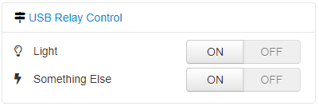
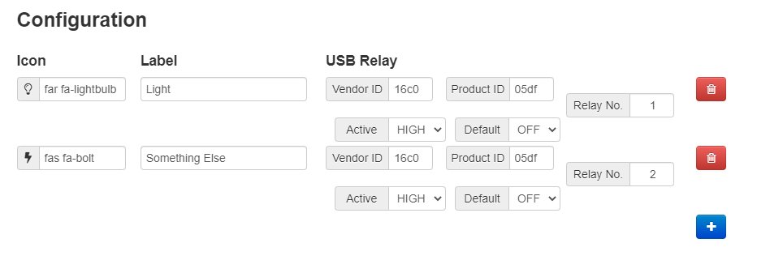

# OctoPrint USB Relay Control

USB Relay Control adds a sidebar with on/off buttons. You can add as many buttons as you want that will control each USB Relay connected to your Raspberry Pi.

Very useful if you want to add some electronic/improvements to your printer.




Note that the layout of the settings in the plugin configuration menu is awful.  If anyone knows their way round jinja2 and would like to help fix this, I'd very grateful!

## Setup

Install via the bundled [Plugin Manager](https://docs.octoprint.org/en/master/bundledplugins/pluginmanager.html)
or manually using this URL:

    https://github.com/abudden/OctoPrint-USBRelayControl/archive/master.zip

The module depends on the [hidapi module](https://github.com/trezor/cython-hidapi), which can be installed like this:

```
sudo apt-get install python3-dev libusb-1.0-0-dev libudev-dev
python3 -m pip install --upgrade setuptools
python3 -m pip install hidapi
```

You'll also need to make sure that the USB relay can be controlled without root privileges.

For example, edit `/etc/udev/rules.d/99-usbrelay.rules` and add this line:

```
SUBSYSTEM=="usb", ATTR{idVendor}=="16c0", ATTR{idProduct}=="05df", MODE="777"
```

Then restart your computer.

The vendor ID and product ID (which you'll also need in the octoprint configuration) can be found using the `lsusb` command.  The easiest way to do this is to run `lsusb`, then plug your device in, then run `lsusb` again.  One new line should have appeared and this will contain the `ID XXXX:YYYY` where `XXXX` is the vendor ID and `YYYY` is the product ID.

## Configuration

Just add correct relay configuration:

- select icon using icon picker (or typing manually) for better identification
- type name for your device connected to the relay
- Add the vendor ID and product ID for the relay (defaults to 16C0 and 05DF)
- Add the relay number on the board
- select whether relay active corresponds with turning your device on or off
    - _active high_ means that device is **on when the relay is activated**
    - _active low_ means that device is **off when the relay is activated**
- select if device should be on or off by default eg. after startup

Note that there's very little in the way of error checking, so if you put incorrect values into any of the fields, it'll probably break something.

## Credits

This plugin was created as a combination of two other excellent projects:

* [OctoPrint GPIO Control](https://github.com/catgiggle/OctoPrint-GpioControl) by Damian Wójcik, which provided the framework and most of the octoprint interaction.
* [Very Simple USB Relay](https://github.com/jaketeater/Very-Simple-USB-Relay) by jaketeater, which provided the code required to drive the relays.

<!-- vim: set ft=pandoc : -->
